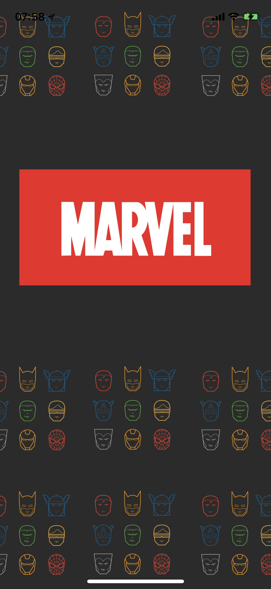
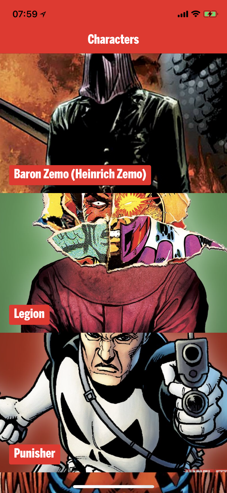
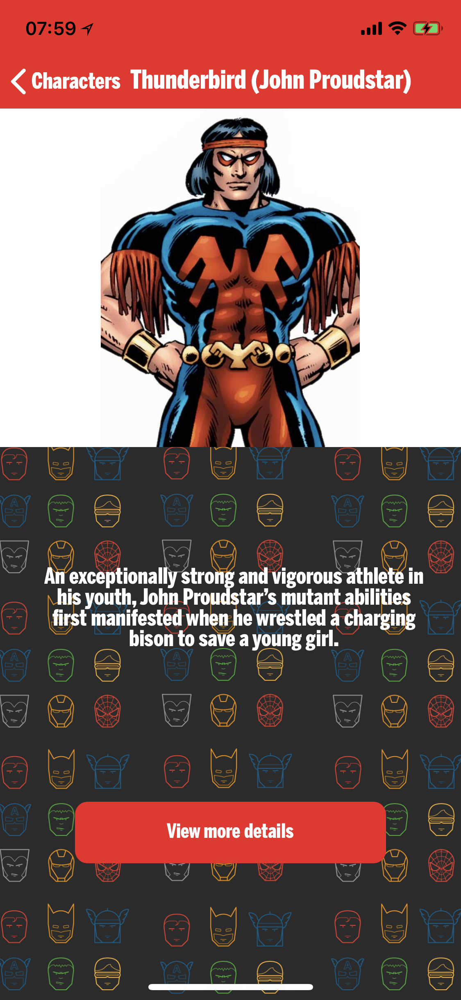
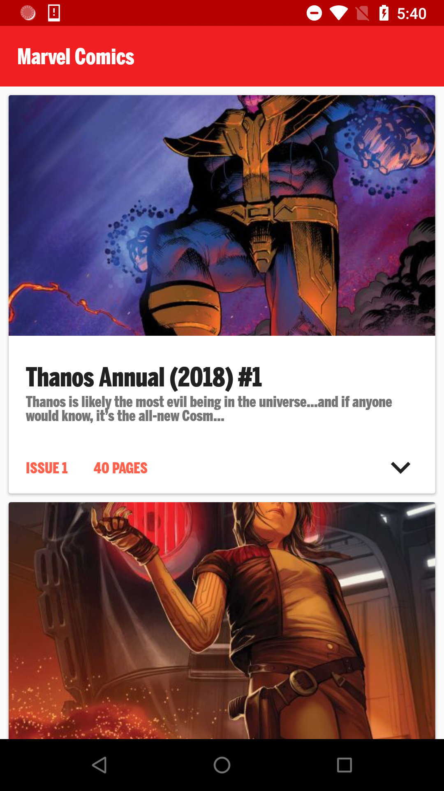
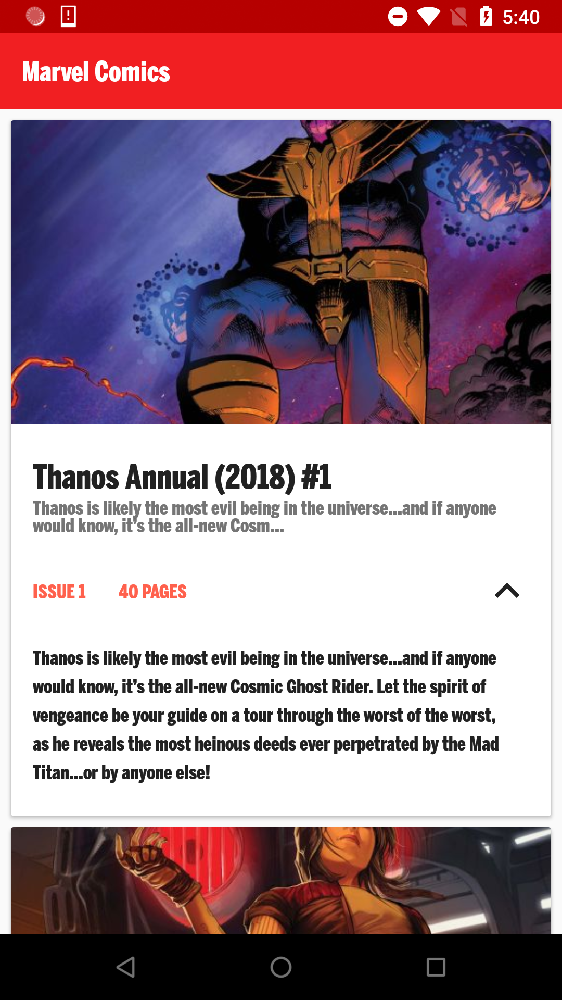

# Marvel

     

## About

This repository contains the source code for two take-home projects that I made as part of the interview process for a company. The iOS folder contains the iPhone app which loads and displays comic characters from the Marvel Characters API. The Android folder contains an Android app which loads and displays comics from the Marvel Comics API.

It took a total of 3 days to build both apps. It was a fun challenge and I really enjoyed making the apps and learning more in the process. If I had more time, I would've improved my code even further and written more unit tests (and UI tests as well).

- The iOS app is built using **Clean Swift** architecture and it has zero dependencies. It's written purely in Swift (except *one* line of code in OBJ-C for the bridging header for CommonCrypto).

- The Android app is built using **Clean Architecture** and **MVP**. It uses **Retrofit** for networking, **Dagger 2** for dependency injection, **Android Architecture Components** for lifecycle management and **Kotlin coroutines** for asynchronous work. It also uses **Glide** for image loading and **Mockito** for unit testing. It's written purely in Kotlin (no Java!).

## Screenshots

### Screenshots (iOS)

</img> </img> </img>

### Screenshots (Android)

</img> </img>
